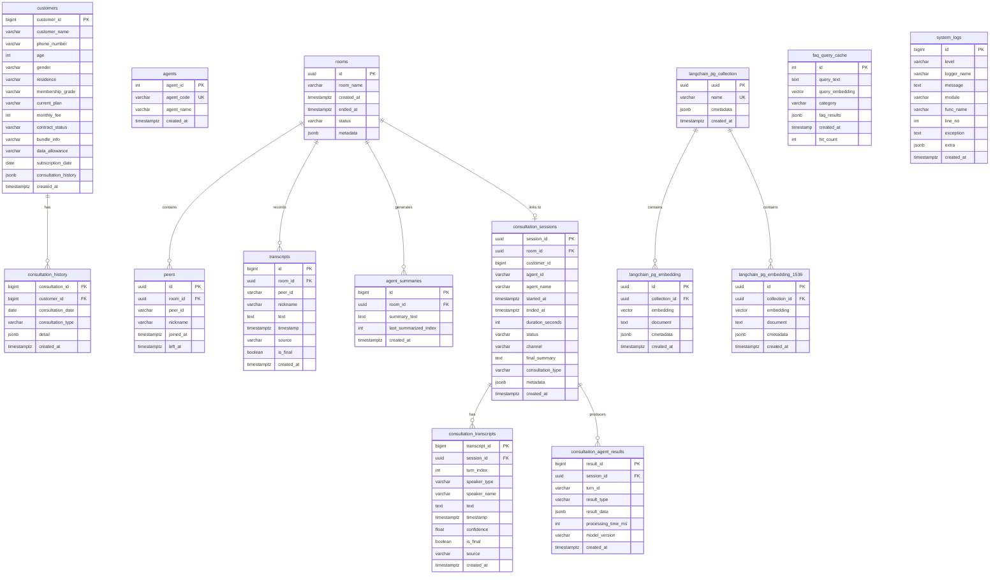

# Database ER Diagram

## Overview

PostgreSQL 데이터베이스 구조 (realtime_assist)

## Table Summary

| Domain | Table | Description |
|--------|-------|-------------|
| **Customer** | `customers` | KT 고객 정보 (요금제, 등급 등) |
| | `consultation_history` | 고객별 상담 이력 |
| **Agent** | `agents` | 상담사 정보 |
| **Realtime Call** | `rooms` | WebRTC 상담 룸 |
| | `peers` | 룸 참가자 |
| | `transcripts` | STT 실시간 전사 |
| | `agent_summaries` | LangGraph 요약 결과 |
| **Consultation Session** | `consultation_sessions` | 상담 세션 메타데이터 |
| | `consultation_transcripts` | 정제된 대화 기록 |
| | `consultation_agent_results` | AI 분석 결과 |
| **Vector DB** | `langchain_pg_collection` | 임베딩 컬렉션 |
| | `langchain_pg_embedding` | 문서 임베딩 (3072 dim) |
| | `langchain_pg_embedding_1536` | 문서 임베딩 (1536 dim) |
| **System** | `faq_query_cache` | FAQ 검색 캐시 |
| | `system_logs` | 시스템 로그 |

## Domain Details

### Customer Domain
- `customers`: 고객 기본 정보, 요금제, 멤버십 등급 관리
- `consultation_history`: 고객별 상담 이력 추적 (FK: customer_id)

### Realtime Call Domain
- `rooms`: WebRTC 기반 상담 룸 (중심 엔티티)
- `peers`: 룸에 참가한 사용자 (상담사/고객)
- `transcripts`: Google STT로 실시간 전사된 대화
- `agent_summaries`: LangGraph 에이전트가 생성한 요약

### Consultation Session Domain
- `consultation_sessions`: 상담 세션 메타데이터 (rooms와 연결)
- `consultation_transcripts`: turn 단위로 정제된 대화 기록
- `consultation_agent_results`: AI 분석 결과 (의도 파악, 추천 등)

### Vector DB Domain (LangChain/RAG)
- `langchain_pg_collection`: 벡터 컬렉션 (FAQ, 정책 문서 등)
- `langchain_pg_embedding`: 문서 임베딩 저장
- `langchain_pg_embedding_1536`: 1536차원 임베딩 (OpenAI ada-002)

### System Domain
- `faq_query_cache`: FAQ 검색 결과 캐싱 (벡터 유사도 검색 최적화)
- `system_logs`: 애플리케이션 로그 저장

## Views

- `customer_consultation_summary`: 고객별 상담 요약 뷰
- `room_conversation_summary`: 룸별 대화 요약 뷰
