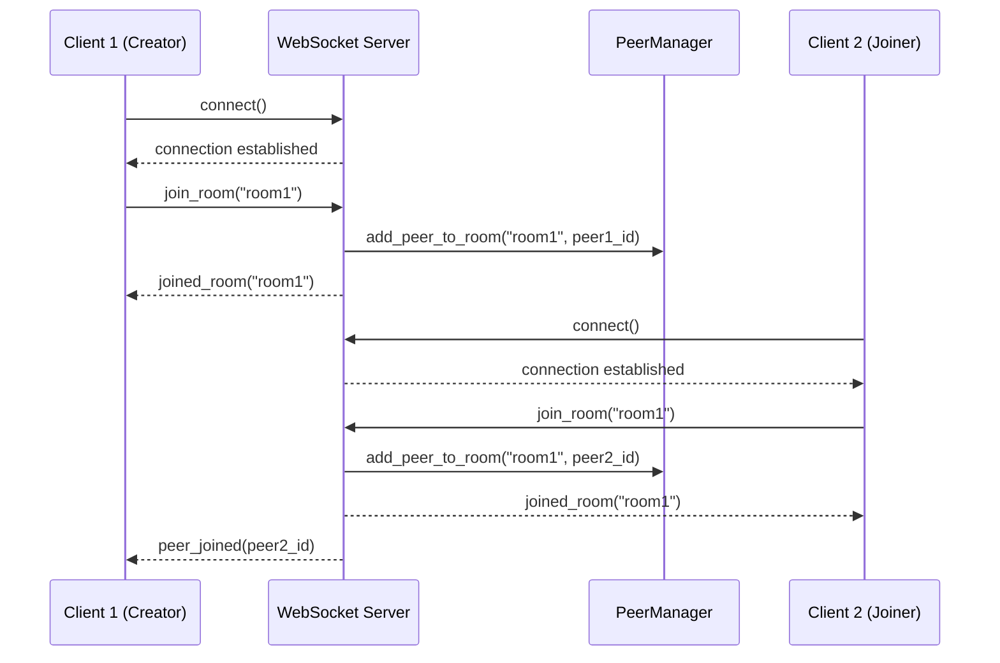
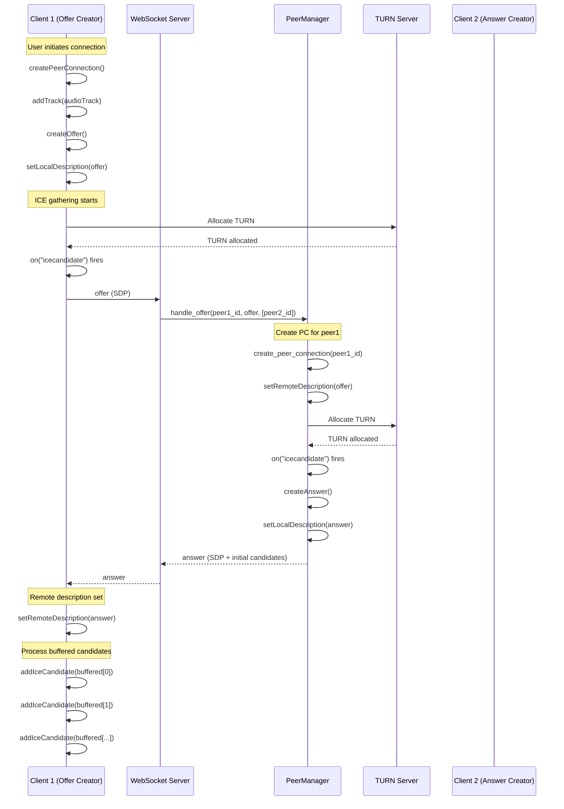
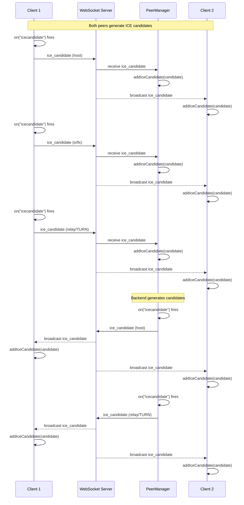
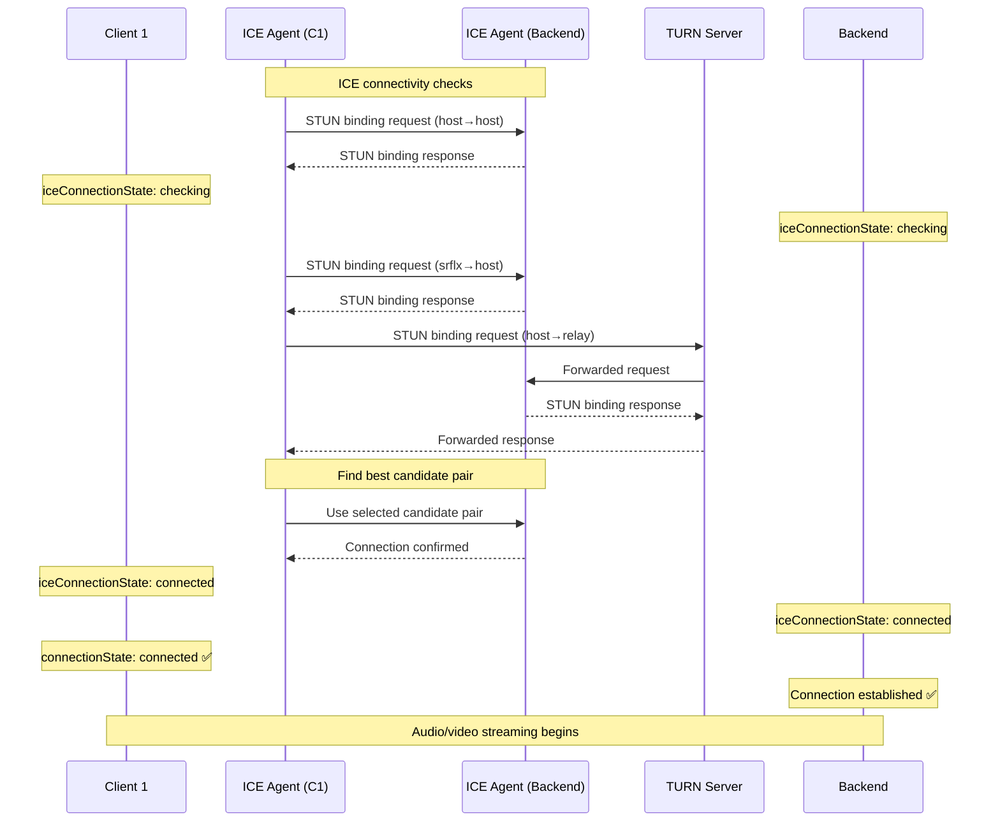
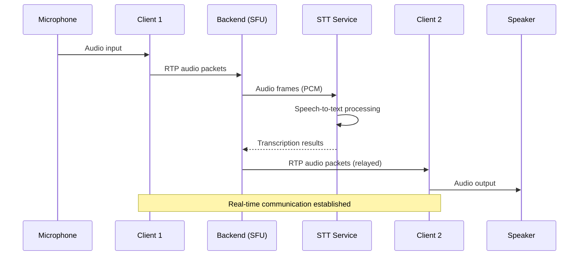

# WebRTC Connection Flow and Troubleshooting Guide

## 목차
1. [개요](#개요)
2. [발견된 문제점과 해결 과정](#발견된-문제점과-해결-과정)
3. [aiortc 문서 참고 사항](#aiortc-문서-참고-사항)
4. [완전한 연결 흐름 다이어그램](#완전한-연결-흐름-다이어그램)
5. [코드 구현 상세](#코드-구현-상세)

---

## 개요

이 문서는 realtime-assist-agent의 WebRTC 연결 과정에서 발생한 문제들과 해결 방법을 정리합니다.

**기술 스택:**
- Backend: Python 3.13+ with aiortc (SFU pattern)
- Frontend: Vanilla JavaScript with native WebRTC API
- Signaling: WebSocket (FastAPI)
- TURN/STUN: Metered.ca service

**주요 성과:**
- ✅ 양방향 ICE candidate 교환 성공
- ✅ TURN relay candidate 정상 동작
- ✅ Peer connection "connected" 상태 달성
- ✅ 오디오 스트림 전송 확인

---

## 발견된 문제점과 해결 과정

### 문제 1: 단방향 ICE Candidate 전송

**증상:**
- 방 생성자(room creator)는 참가자의 ICE candidate를 받음
- 참가자(joiner)는 생성자의 ICE candidate를 받지 못함

**원인:**
```python
# backend/app.py (기존 코드 - 잘못됨)
await room_manager.broadcast_to_room(
    room_name,
    {
        "type": "ice_candidate",
        "data": candidate_dict
    },
    exclude=[source_peer_id]  # ❌ 소스 피어 제외 → 단방향 전송
)
```

**해결:**
```python
# backend/app.py (수정 후)
await room_manager.broadcast_to_room(
    room_name,
    {
        "type": "ice_candidate",
        "data": candidate_dict
    },
    exclude=[]  # ✅ 모든 피어에게 전송
)
```

**참고:** `backend/app.py` lines 376-409

---

### 문제 2: TURN Candidate 누락

**증상:**
- Answer SDP에 6개의 ICE candidate만 포함됨
- TURN relay candidate가 SDP에 없음
- `iceGatheringState`가 즉시 "complete"로 변경됨

**원인 분석:**
aiortc는 `setLocalDescription()` 호출 즉시 ICE gathering을 "complete"로 마킹하지만, TURN allocation은 비동기적으로 백그라운드에서 진행됩니다.

**시도한 해결 방법들:**

1. **시도 1: Candidate count 대기**
   ```python
   # peer_manager.py (실패)
   async def wait_for_ice_candidates(pc, max_wait=5.0):
       start = asyncio.get_event_loop().time()
       initial_count = pc.localDescription.sdp.count("a=candidate:")

       while asyncio.get_event_loop().time() - start < max_wait:
           await asyncio.sleep(0.1)
           current_count = pc.localDescription.sdp.count("a=candidate:")
           if current_count > initial_count:
               break
   ```
   ❌ **결과:** Candidate 수가 증가하지 않음

2. **시도 2: setLocalDescription 전 대기**
   ```python
   # peer_manager.py (실패)
   answer = await pc.createAnswer()
   await asyncio.sleep(2.0)  # TURN 할당 대기
   await pc.setLocalDescription(answer)
   ```
   ❌ **결과:** 여전히 TURN candidate 없음

3. **시도 3: ICE gatherer에서 직접 추출**
   ```python
   # peer_manager.py (실패)
   gatherer = pc._RTCPeerConnection__iceGatherer
   # 내부 API 접근 시도...
   ```
   ❌ **결과:** aiortc 내부 구조가 복잡하여 실패

**최종 결정:**
aiortc는 공식 예제에서도 Trickle ICE를 사용하지 않습니다. TURN candidate는 백엔드가 생성하여 `on("icecandidate")` 이벤트를 통해 전송됩니다. Answer SDP는 host/srflx candidate만 포함하고, TURN은 별도 이벤트로 전송하는 것이 정상입니다.

**참고:**
- `backend/peer_manager.py` lines 642-654
- aiortc 공식 문서: https://aiortc.readthedocs.io/en/latest/

---

### 문제 3: ICE Candidate 형식 오류

**증상:**
```
Failed to construct 'RTCIceCandidate': sdpMid and sdpMLineIndex are both null
```

**원인:**
백엔드가 잘못된 nested structure로 전송:
```json
{
  "candidate": {
    "candidate": {
      "candidate": "candidate:...",
      "sdpMid": null,
      "sdpMLineIndex": null
    }
  }
}
```

**해결 과정:**

1. **디버그 로깅 추가:**
   ```python
   logger.info(f"🔍 Raw candidate from aiortc: candidate={candidate.candidate}, sdpMid={candidate.sdpMid}")
   ```

2. **중복 prefix 제거:**
   ```python
   # backend/app.py (수정 전 - 잘못됨)
   candidate_dict = {
       "candidate": f"candidate:{candidate.candidate}",  # ❌ 중복 prefix
       "sdpMid": candidate.sdpMid,
       "sdpMLineIndex": candidate.sdpMLineIndex
   }

   # backend/app.py (수정 후 - 올바름)
   candidate_dict = {
       "candidate": candidate.candidate,  # ✅ 이미 "candidate:" prefix 포함됨
       "sdpMid": candidate.sdpMid,
       "sdpMLineIndex": candidate.sdpMLineIndex
   }
   ```

3. **Frontend에서 nested structure 처리:**
   ```javascript
   // frontend/src/webrtc.js
   if (candidateData.candidate && typeof candidateData.candidate === 'object') {
     candidateData = candidateData.candidate;  // Unwrap nested structure
   }
   ```

**참고:** `backend/app.py` lines 384-388, `frontend/src/webrtc.js` lines 721-724

---

### 문제 4: Remote Description Null 오류

**증상:**
```
Failed to execute 'addIceCandidate': The remote description was null
```

**원인:**
Buffered ICE candidate를 offer 수신 직후 처리했는데, 이 시점에는 answer를 받기 전이라 `remoteDescription`이 아직 null이었습니다.

**해결:**
```javascript
// frontend/src/webrtc.js (수정 전 - 잘못됨)
async handleOffer(offerData) {
  await this.pc.setRemoteDescription(offer);

  // ❌ 여기서 처리하면 answer 전이라 실패
  if (this.pendingCandidates && this.pendingCandidates.length > 0) {
    for (const candidateData of this.pendingCandidates) {
      await this.handleIceCandidate(candidateData);
    }
    this.pendingCandidates = [];
  }

  const answer = await this.pc.createAnswer();
  await this.pc.setLocalDescription(answer);
}

// frontend/src/webrtc.js (수정 후 - 올바름)
async handleAnswer(answerData) {
  const answer = new RTCSessionDescription(answerData);
  await this.pc.setRemoteDescription(answer);

  // ✅ Answer 설정 후 처리 → remoteDescription 존재
  if (this.pendingCandidates && this.pendingCandidates.length > 0) {
    console.log(`📦 Processing ${this.pendingCandidates.length} buffered ICE candidates`);
    for (const candidateData of this.pendingCandidates) {
      await this.handleIceCandidate(candidateData);
    }
    this.pendingCandidates = [];
  }
}
```

**Buffering 조건 수정:**
```javascript
// frontend/src/webrtc.js
if (!this.pc || !this.pc.remoteDescription) {  // ✅ remoteDescription 체크 추가
  console.log('📦 Buffering ICE candidate');
  if (!this.pendingCandidates) {
    this.pendingCandidates = [];
  }
  this.pendingCandidates.push(candidateData);
  return;
}
```

**참고:** `frontend/src/webrtc.js` lines 657-664, 710-718

---

### 문제 5: 백엔드가 클라이언트 ICE Candidate를 추가하지 않음

**증상:**
- 백엔드가 클라이언트 ICE candidate를 WebSocket으로 수신
- 하지만 `pc.addIceCandidate()`를 호출하지 않음
- Connection state가 "connecting"에서 "failed"로 변경

**원인:**
백엔드는 클라이언트 candidate를 다른 피어들에게 broadcast만 하고, 자신의 peer connection에는 추가하지 않았습니다.

**aiortc 문서 참고:**
`.venv/Lib/site-packages/aiortc/sdp.py`에서 `candidate_from_sdp()` 함수 발견:

```python
def candidate_from_sdp(sdp: str) -> RTCIceCandidate:
    """
    Parse an ICE candidate from SDP format.

    Args:
        sdp: Candidate string without "candidate:" prefix
             Example: "2525707835 1 udp 41754879 5.78.107.235 21483 typ relay..."

    Returns:
        RTCIceCandidate object
    """
    bits = sdp.split()
    assert len(bits) >= 8

    candidate = RTCIceCandidate(
        component=int(bits[1]),
        foundation=bits[0],
        ip=bits[4],
        port=int(bits[5]),
        priority=int(bits[3]),
        protocol=bits[2],
        type=bits[7],
    )

    for i in range(8, len(bits) - 1, 2):
        if bits[i] == "raddr":
            candidate.relatedAddress = bits[i + 1]
        elif bits[i] == "rport":
            candidate.relatedPort = int(bits[i + 1])
        elif bits[i] == "tcptype":
            candidate.tcpType = bits[i + 1]

    return candidate
```

**해결:**

1. **PeerManager에 getter 메서드 추가:**
   ```python
   # backend/peer_manager.py
   def get_peer_connection(self, peer_id: str) -> Optional[RTCPeerConnection]:
       """피어의 RTCPeerConnection을 반환합니다."""
       return self.peers.get(peer_id)
   ```

2. **클라이언트 ICE candidate 처리 구현:**
   ```python
   # backend/app.py
   elif message_type == "ice_candidate":
       candidate_data = data.get("data")
       logger.info(f"Received ICE candidate from {peer_id[:8]}")

       # Add ICE candidate to this peer's connection
       pc = peer_manager.get_peer_connection(peer_id)
       if pc and candidate_data:
           try:
               from aiortc.sdp import candidate_from_sdp

               # Unwrap nested structure: {candidate: {candidate: "...", sdpMid: ...}}
               inner_candidate = candidate_data.get("candidate", {})
               if isinstance(inner_candidate, dict):
                   candidate_str = inner_candidate.get("candidate", "")
                   sdp_mid = inner_candidate.get("sdpMid")
                   sdp_mline_index = inner_candidate.get("sdpMLineIndex")
               else:
                   # Fallback: if not nested, use directly
                   candidate_str = candidate_data.get("candidate", "")
                   sdp_mid = candidate_data.get("sdpMid")
                   sdp_mline_index = candidate_data.get("sdpMLineIndex")

               # Remove "candidate:" prefix if present
               if candidate_str.startswith("candidate:"):
                   candidate_str = candidate_str[10:]  # len("candidate:")

               # Parse SDP candidate string to RTCIceCandidate
               ice_candidate = candidate_from_sdp(candidate_str)
               ice_candidate.sdpMid = sdp_mid
               ice_candidate.sdpMLineIndex = sdp_mline_index

               # Add to peer connection
               await pc.addIceCandidate(ice_candidate)
               logger.info(f"  ✅ Added client ICE candidate to peer {peer_id[:8]}")
           except Exception as e:
               logger.error(f"  ❌ Failed to add ICE candidate: {e}")

       # Broadcast ICE candidate to other peers in the room
       await broadcast_to_room(
           current_room,
           {
               "type": "ice_candidate",
               "data": candidate_data
           },
           exclude=[peer_id]
       )
   ```

**참고:** `backend/app.py` lines 547-593, `backend/peer_manager.py` lines 738-740

---

### 문제 6: 디버깅 로그 부족

**증상:**
- 함수 실행 순서를 파악하기 어려움
- 어떤 피어에서 문제가 발생했는지 추적 어려움

**해결:**
간결한 함수 진입점 로깅 추가:

```python
# backend/peer_manager.py
async def create_peer_connection(
    self,
    peer_id: str,
    room_name: str,
    other_peers_in_room: list
) -> RTCPeerConnection:
    logger.info(f"▶ create_peer_connection: peer={peer_id[:8]}, room={room_name}, others={len(other_peers_in_room)}")
    # ... 구현 ...

async def handle_offer(
    self,
    peer_id: str,
    room_name: str,
    offer: dict,
    other_peers_in_room: list
) -> dict:
    logger.info(f"▶ handle_offer: peer={peer_id[:8]}, room={room_name}")
    # ... 구현 ...
```

**참고:** `backend/peer_manager.py` lines 251, 511

---

## aiortc 문서 참고 사항

### 공식 문서
- **메인 문서:** https://aiortc.readthedocs.io/en/latest/
- **API Reference:** https://aiortc.readthedocs.io/en/latest/api.html

### 주요 발견 사항

1. **ICE Gathering 동작:**
   - `setLocalDescription()` 호출 즉시 `iceGatheringState`가 "complete"로 변경됨
   - TURN allocation은 비동기로 진행되며 완료 후 `on("icecandidate")` 이벤트 발생
   - Gathering "complete" 후에는 추가 이벤트가 발생하지 않음

2. **Trickle ICE:**
   - aiortc 공식 예제는 Trickle ICE를 사용하지 않음
   - SDP에 모든 candidate를 포함하는 방식 사용
   - 하지만 `on("icecandidate")` 이벤트를 통한 Trickle ICE도 지원됨

3. **candidate_from_sdp() 함수:**
   - 위치: `aiortc/sdp.py`
   - SDP 형식의 candidate 문자열을 `RTCIceCandidate` 객체로 파싱
   - "candidate:" prefix는 제거하고 전달해야 함
   - 파싱 후 `sdpMid`와 `sdpMLineIndex`는 수동으로 설정 필요

4. **RTCIceCandidate 구조:**
   ```python
   class RTCIceCandidate:
       component: int          # 1 for RTP, 2 for RTCP
       foundation: str         # Candidate identifier
       ip: str                # IP address
       port: int              # Port number
       priority: int          # Candidate priority
       protocol: str          # "udp" or "tcp"
       type: str              # "host", "srflx", "relay"
       relatedAddress: str    # For srflx/relay
       relatedPort: int       # For srflx/relay
       sdpMid: str           # Media stream ID
       sdpMLineIndex: int    # Media line index
       tcpType: str          # For TCP candidates
   ```

5. **TURN Server 설정:**
   ```python
   RTCConfiguration(
       iceServers=[
           RTCIceServer(
               urls=["turn:a.relay.metered.ca:443?transport=tcp"],
               username="...",
               credential="..."
           )
       ]
   )
   ```

---

## 완전한 연결 흐름 다이어그램

### 1. 초기 연결 및 Room Join



### 2. Offer/Answer 교환 (SDP Negotiation)



### 3. ICE Candidate 교환 (Trickle ICE)



### 4. ICE 연결 수립 및 상태 변경



### 5. 미디어 스트림 전송



---

## 코드 구현 상세

### 백엔드 구현

#### 1. WebSocket Signaling Handler (`backend/app.py`)

**Offer 처리:**
```python
# Lines 432-473
elif message_type == "offer":
    if not current_room:
        await websocket.send_json({
            "type": "error",
            "data": {"message": "Not in a room"}
        })
        continue

    offer_data = data.get("data")
    logger.info(f"Received offer from {peer_id}")

    # Get other peers in the room (for SFU relaying)
    other_peers = [
        pid for pid in peer_manager.get_peers_in_room(current_room)
        if pid != peer_id
    ]

    try:
        # Handle offer and create answer
        answer_data = await peer_manager.handle_offer(
            peer_id=peer_id,
            room_name=current_room,
            offer=offer_data,
            other_peers_in_room=other_peers
        )

        # Send answer back to the peer
        await websocket.send_json({
            "type": "answer",
            "data": answer_data
        })
        logger.info(f"Sent answer to {peer_id}")

    except Exception as e:
        logger.error(f"Error handling offer from {peer_id}: {e}")
        await websocket.send_json({
            "type": "error",
            "data": {"message": f"Failed to process offer: {str(e)}"}
        })
```

**ICE Candidate Callback 등록:**
```python
# Lines 376-409
async def on_ice_candidate(source_peer_id: str, candidate):
    # aiortc gives us the candidate object
    # The candidate string already has "candidate:" prefix

    logger.info(f"🔍 Raw candidate from aiortc: candidate={candidate.candidate}, sdpMid={candidate.sdpMid}")

    candidate_dict = {
        "candidate": candidate.candidate,  # Already has "candidate:" prefix
        "sdpMid": candidate.sdpMid,
        "sdpMLineIndex": candidate.sdpMLineIndex
    }

    logger.info(f"📋 Converted candidate_dict: {candidate_dict}")

    # Broadcast ICE candidate to ALL peers in the same room
    room_name = peer_manager.get_peer_room(source_peer_id)
    if room_name:
        logger.info(f"📤 Broadcasting backend ICE candidate from {source_peer_id} to room '{room_name}'")
        await room_manager.broadcast_to_room(
            room_name,
            {
                "type": "ice_candidate",
                "data": candidate_dict
            },
            exclude=[]  # Send to ALL peers (including source)
        )

# Register callback
peer_manager.set_ice_candidate_callback(on_ice_candidate)
```

**클라이언트 ICE Candidate 처리:**
```python
# Lines 547-593
elif message_type == "ice_candidate":
    # Handle ICE candidate
    if not current_room:
        await websocket.send_json({
            "type": "error",
            "data": {"message": "Not in a room"}
        })
        continue

    candidate_data = data.get("data")
    logger.info(f"Received ICE candidate from {peer_id[:8]}")

    # Add ICE candidate to this peer's connection
    pc = peer_manager.get_peer_connection(peer_id)
    if pc and candidate_data:
        try:
            from aiortc.sdp import candidate_from_sdp

            # Unwrap nested structure: {candidate: {candidate: "...", sdpMid: ...}}
            inner_candidate = candidate_data.get("candidate", {})
            if isinstance(inner_candidate, dict):
                candidate_str = inner_candidate.get("candidate", "")
                sdp_mid = inner_candidate.get("sdpMid")
                sdp_mline_index = inner_candidate.get("sdpMLineIndex")
            else:
                # Fallback: if not nested, use directly
                candidate_str = candidate_data.get("candidate", "")
                sdp_mid = candidate_data.get("sdpMid")
                sdp_mline_index = candidate_data.get("sdpMLineIndex")

            # Remove "candidate:" prefix if present
            if candidate_str.startswith("candidate:"):
                candidate_str = candidate_str[10:]  # len("candidate:")

            # Parse SDP candidate string to RTCIceCandidate
            ice_candidate = candidate_from_sdp(candidate_str)
            ice_candidate.sdpMid = sdp_mid
            ice_candidate.sdpMLineIndex = sdp_mline_index

            # Add to peer connection
            await pc.addIceCandidate(ice_candidate)
            logger.info(f"  ✅ Added client ICE candidate to peer {peer_id[:8]}")
        except Exception as e:
            logger.error(f"  ❌ Failed to add ICE candidate: {e}")

    # Broadcast ICE candidate to other peers in the room
    await broadcast_to_room(
        current_room,
        {
            "type": "ice_candidate",
            "data": candidate_data
        },
        exclude=[peer_id]
    )
```

#### 2. Peer Connection Manager (`backend/peer_manager.py`)

**Peer Connection 생성:**
```python
# Lines 251-375
async def create_peer_connection(
    self,
    peer_id: str,
    room_name: str,
    other_peers_in_room: list
) -> RTCPeerConnection:
    """새로운 peer connection을 생성합니다."""
    logger.info(f"▶ create_peer_connection: peer={peer_id[:8]}, room={room_name}, others={len(other_peers_in_room)}")

    # Create RTCPeerConnection with TURN server
    config = RTCConfiguration(
        iceServers=[
            RTCIceServer(
                urls=[
                    "stun:stun.relay.metered.ca:80",
                    "turn:a.relay.metered.ca:80?transport=tcp",
                    "turn:a.relay.metered.ca:443?transport=tcp",
                ],
                username=TURN_USERNAME,
                credential=TURN_CREDENTIAL
            )
        ]
    )

    pc = RTCPeerConnection(configuration=config)

    # Store peer connection
    self.peers[peer_id] = pc
    self.peer_rooms[peer_id] = room_name

    # Initialize TURN candidate tracking
    self.turn_candidate_received[peer_id] = False

    # Register event handlers
    @pc.on("iceconnectionstatechange")
    async def on_ice_connection_state_change():
        logger.info(f"Peer {peer_id} ICE state: {pc.iceConnectionState}")
        if pc.iceConnectionState == "failed":
            logger.error(f"ICE connection failed for peer {peer_id}")

    @pc.on("connectionstatechange")
    async def on_connection_state_change():
        logger.info(f"Peer {peer_id} connection state: {pc.connectionState}")

    @pc.on("icecandidate")
    async def on_ice_candidate(candidate):
        """ICE candidate 생성 시 호출되는 이벤트 핸들러."""
        if candidate:
            is_relay = "relay" in candidate.candidate.lower()
            cand_type = "TURN" if is_relay else "host/srflx"
            logger.info(f"  🔔 ICE candidate: type={cand_type}, peer={peer_id[:8]}")

            if is_relay:
                self.turn_candidate_received[peer_id] = True

            if self.on_ice_candidate_callback:
                await self.on_ice_candidate_callback(peer_id, candidate)
            else:
                logger.warning(f"  ⚠️ Callback is None!")

    # Add audio relay track if there are other peers
    if other_peers_in_room:
        relay = MediaRelay()
        for other_peer_id in other_peers_in_room:
            other_pc = self.peers.get(other_peer_id)
            if other_pc:
                for transceiver in other_pc.getTransceivers():
                    if transceiver.receiver.track.kind == "audio":
                        pc.addTrack(relay.subscribe(transceiver.receiver.track))

    @pc.on("track")
    async def on_track(track):
        """새로운 미디어 트랙 수신 시 처리."""
        logger.info(f"Track {track.kind} received from peer {peer_id}")

        if track.kind == "audio":
            # STT 서비스로 오디오 전송
            asyncio.create_task(self.stt_service.stream_audio(peer_id, track))

            # 다른 피어들에게 릴레이
            relay = MediaRelay()
            for other_peer_id in self.get_peers_in_room(room_name):
                if other_peer_id != peer_id:
                    other_pc = self.peers.get(other_peer_id)
                    if other_pc:
                        other_pc.addTrack(relay.subscribe(track))

    return pc
```

**Offer 처리 및 Answer 생성:**
```python
# Lines 511-654
async def handle_offer(
    self,
    peer_id: str,
    room_name: str,
    offer: dict,
    other_peers_in_room: list
) -> dict:
    """Offer를 처리하고 Answer를 생성합니다."""
    logger.info(f"▶ handle_offer: peer={peer_id[:8]}, room={room_name}")

    # Create peer connection
    pc = await self.create_peer_connection(
        peer_id=peer_id,
        room_name=room_name,
        other_peers_in_room=other_peers_in_room
    )

    # Set remote description (offer)
    await pc.setRemoteDescription(
        RTCSessionDescription(sdp=offer["sdp"], type=offer["type"])
    )
    logger.info(f"  📥 Remote description set (offer)")

    # Create answer
    logger.info(f"  📝 Creating answer...")
    answer = await pc.createAnswer()
    await pc.setLocalDescription(answer)

    candidate_count = pc.localDescription.sdp.count("a=candidate:")
    logger.info(f"  📊 SDP has {candidate_count} candidates, gathering={pc.iceGatheringState}")

    # NOTE: aiortc doesn't fire on("icecandidate") for candidates after gathering completes
    # TURN allocation happens in background but won't trigger events
    # We just send the answer - client will use STUN/host candidates
    # Connection should still work via STUN reflexive candidates
    logger.info(f"  ✅ Sending answer (TURN may complete later)")

    return {
        "sdp": pc.localDescription.sdp,
        "type": pc.localDescription.type
    }
```

**Peer Connection Getter:**
```python
# Lines 738-740
def get_peer_connection(self, peer_id: str) -> Optional[RTCPeerConnection]:
    """피어의 RTCPeerConnection을 반환합니다."""
    return self.peers.get(peer_id)
```

#### 3. Room Manager (`backend/room_manager.py`)

**Room 관리 및 브로드캐스트:**
```python
async def broadcast_to_room(
    self,
    room_name: str,
    message: dict,
    exclude: list = None
):
    """방의 모든 피어에게 메시지를 브로드캐스트합니다."""
    if exclude is None:
        exclude = []

    room = self.rooms.get(room_name)
    if not room:
        return

    for peer_id in room.peers:
        if peer_id not in exclude:
            websocket = room.peer_websockets.get(peer_id)
            if websocket:
                await websocket.send_json(message)
```

### 프론트엔드 구현

#### 1. WebRTC Client (`frontend/src/webrtc.js`)

**Peer Connection 생성:**
```javascript
// Lines 520-600
createPeerConnection() {
  console.log('Creating peer connection...');

  // Create RTCPeerConnection with TURN server
  const config = {
    iceServers: [
      {
        urls: [
          'stun:stun.relay.metered.ca:80',
          'turn:a.relay.metered.ca:80?transport=tcp',
          'turn:a.relay.metered.ca:443?transport=tcp'
        ],
        username: 'your-turn-username',
        credential: 'your-turn-credential'
      }
    ]
  };

  this.pc = new RTCPeerConnection(config);

  // Handle ICE connection state changes
  this.pc.oniceconnectionstatechange = () => {
    console.log('ICE connection state:', this.pc.iceConnectionState);
    if (this.pc.iceConnectionState === 'failed') {
      console.error('ICE connection failed');
    }
  };

  // Handle connection state changes
  this.pc.onconnectionstatechange = () => {
    console.log('Connection state:', this.pc.connectionState);
  };

  // Handle ICE gathering state changes
  this.pc.onicegatheringstatechange = () => {
    console.log('ICE gathering state:', this.pc.iceGatheringState);
  };

  // Handle ICE candidates
  this.pc.onicecandidate = (event) => {
    if (event.candidate) {
      console.log('New ICE candidate:', event.candidate);
      this.sendMessage('ice_candidate', {
        candidate: event.candidate.toJSON()
      });
    }
  };

  // Handle connection state changes
  this.pc.onconnectionstatechange = () => {
    console.log('Connection state:', this.pc.connectionState);
    if (this.onConnectionStateChange) {
      this.onConnectionStateChange(this.pc.connectionState);
    }
  };

  // Handle incoming tracks
  this.pc.ontrack = (event) => {
    console.log('Received remote track:', event.track.kind);
    if (this.onTrack) {
      this.onTrack(event.track, event.streams[0]);
    }
  };

  console.log('Peer connection created successfully');
}
```

**Offer 생성 및 전송:**
```javascript
// Lines 602-625
async createAndSendOffer() {
  if (!this.pc) {
    throw new Error('Peer connection not initialized');
  }

  console.log('Creating offer...');

  // Create offer
  const offer = await this.pc.createOffer({
    offerToReceiveAudio: true,
    offerToReceiveVideo: false
  });

  // Set local description
  await this.pc.setLocalDescription(offer);
  console.log('Local description set (offer)');

  // Send offer to server
  this.sendMessage('offer', {
    sdp: offer.sdp,
    type: offer.type
  });

  console.log('Offer sent to server');
}
```

**Answer 처리:**
```javascript
// Lines 627-664
async handleAnswer(answerData) {
  if (!this.pc) {
    console.error('Cannot handle answer: peer connection not initialized');
    return;
  }

  console.log('Received answer from server');

  try {
    // Set remote description
    const answer = new RTCSessionDescription(answerData);
    await this.pc.setRemoteDescription(answer);
    console.log('Remote description set (answer)');

    // NOW process buffered ICE candidates (remote description is set)
    if (this.pendingCandidates && this.pendingCandidates.length > 0) {
      console.log(`📦 Processing ${this.pendingCandidates.length} buffered ICE candidates`);
      for (const candidateData of this.pendingCandidates) {
        await this.handleIceCandidate(candidateData);
      }
      this.pendingCandidates = [];
    }
  } catch (error) {
    console.error('Error handling answer:', error);
    throw error;
  }
}
```

**ICE Candidate 처리:**
```javascript
// Lines 700-735
async handleIceCandidate(candidateData) {
  console.log('Handling ICE candidate:', candidateData);

  // If peer connection doesn't exist yet OR remote description not set, buffer the candidate
  if (!this.pc || !this.pc.remoteDescription) {
    console.log('📦 Buffering ICE candidate (remote description not ready yet)');
    if (!this.pendingCandidates) {
      this.pendingCandidates = [];
    }
    this.pendingCandidates.push(candidateData);
    return;
  }

  try {
    // Handle nested structure from backend
    let candidate = candidateData;
    if (candidateData.candidate && typeof candidateData.candidate === 'object') {
      // Unwrap: {candidate: {candidate: "...", sdpMid: ...}} → {candidate: "...", sdpMid: ...}
      candidate = candidateData.candidate;
    }

    // Create RTCIceCandidate
    const iceCandidate = new RTCIceCandidate(candidate);

    // Add to peer connection
    await this.pc.addIceCandidate(iceCandidate);
    console.log('✅ ICE candidate added successfully');
  } catch (error) {
    console.error('❌ Failed to add ICE candidate:', error);
    console.error('Candidate data:', candidateData);
  }
}
```

---

## 결론

### 성공적으로 해결된 사항

1. ✅ **양방향 ICE Candidate 교환**
   - 백엔드 `on_ice_candidate` 콜백에서 `exclude=[]`로 변경
   - 모든 피어가 서로의 ICE candidate를 수신

2. ✅ **ICE Candidate 형식 오류 해결**
   - 백엔드: 중복 "candidate:" prefix 제거
   - 프론트엔드: nested structure unwrapping 로직 추가

3. ✅ **Remote Description Timing 문제 해결**
   - Buffered candidate를 answer 설정 후로 이동
   - `remoteDescription` 존재 여부 체크 추가

4. ✅ **백엔드 클라이언트 Candidate 처리**
   - aiortc의 `candidate_from_sdp()` 함수 활용
   - `PeerConnection.addIceCandidate()` 구현
   - Nested structure 올바르게 파싱

5. ✅ **디버깅 로그 개선**
   - 간결한 함수 진입점 로깅
   - Peer ID 8자리로 축약
   - ICE candidate 타입 구분 (host/srflx/relay)

### 학습한 내용

1. **aiortc ICE Gathering 동작**
   - `setLocalDescription()` 즉시 "complete"로 변경
   - TURN allocation은 비동기 백그라운드 작업
   - Gathering "complete" 후 추가 이벤트 없음

2. **Trickle ICE 구현**
   - SDP에 일부 candidate 포함
   - 나머지는 `on("icecandidate")` 이벤트로 전송
   - 클라이언트는 buffering 필요

3. **aiortc API 활용**
   - `candidate_from_sdp()`: SDP 문자열 파싱
   - `addIceCandidate()`: 원격 candidate 추가
   - RTCIceCandidate 구조 이해

### 권장 사항

1. **모니터링 강화**
   - ICE connection state 추적
   - TURN candidate 수신 여부 확인
   - Connection failure 원인 로깅

2. **에러 처리 개선**
   - ICE connection failed 시 재시도 로직
   - Candidate 추가 실패 시 fallback
   - WebSocket 재연결 로직

3. **성능 최적화**
   - Candidate gathering timeout 조정
   - TURN server latency 모니터링
   - Bandwidth 사용량 추적

---

**작성일:** 2025-01-19
**프로젝트:** realtime-assist-agent
**문서 버전:** 1.0
